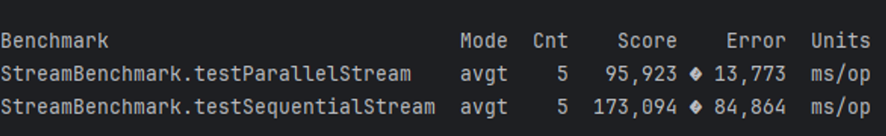

Ejercicio 2:

Se puede ver que si se hace de manera secuencial el tiempo que tarda en resolver es casi el doble y tiene mas variabilidad en el tiempo de resultado a diferencia del paralelo que es más rápido y con menos variación. 